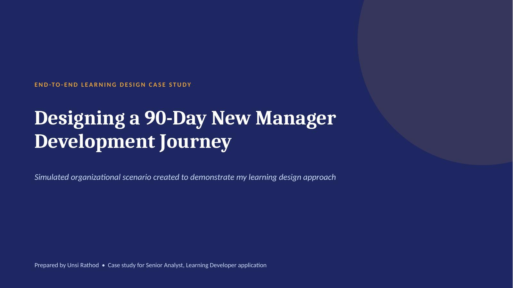
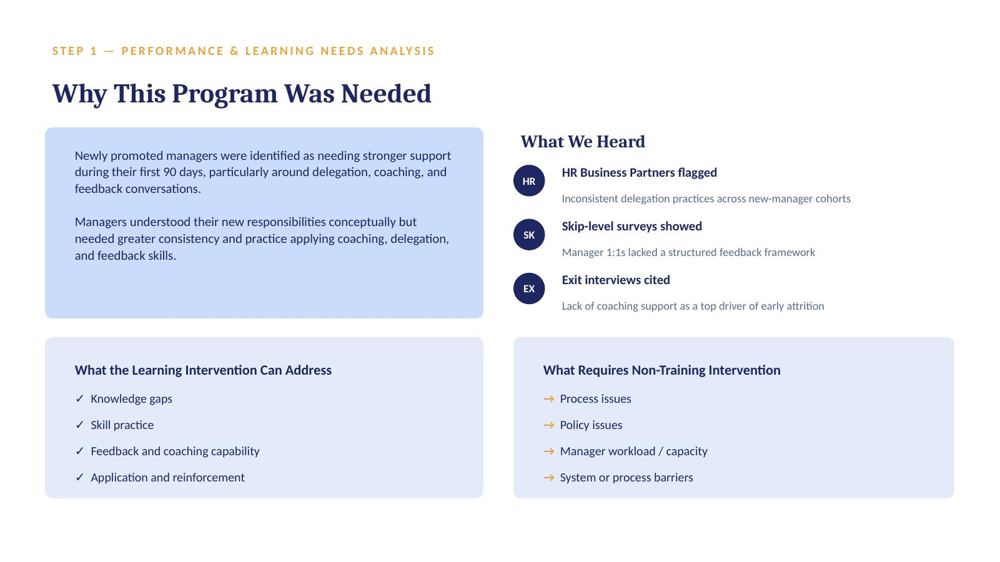
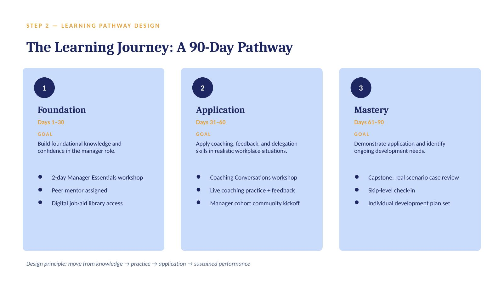
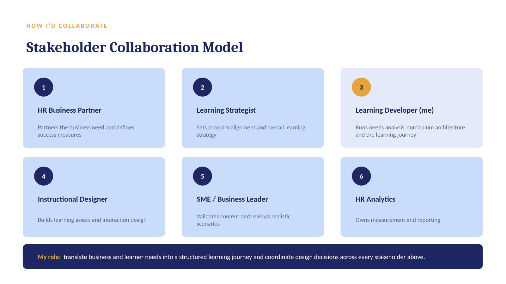

# New Manager Onboarding — A Learning Journey Case Study

A self-directed curriculum design sample built to demonstrate an end-to-end learning
journey — from needs analysis through evaluation — for corporate Learning &
Development roles (e.g. Senior Analyst, Learning Developer).

**This is a simulated organizational scenario**, created to show my design thinking
and methodology, not a program built for a real employer.

📎 [Download the full deck (.pptx)](./new-manager-onboarding-learning-journey.pptx)

## What's inside

The deck walks through a complete curriculum design cycle for a "New Manager
Onboarding" program:

1. **My approach** — Diagnose → Design → Develop → Measure → Reinforce
2. **Performance & learning needs analysis** — what a needs assessment surfaced, and what does / doesn't need a training solution
3. **Learning pathway design** — a 90-day journey across Foundation, Application, and Mastery phases
4. **Sample workshop design** — a full session plan for "Coaching Conversations That Stick," including agenda and learning objectives
5. **Supporting job aid** — a pocket reference card built on the SBI (Situation-Behavior-Impact) feedback framework
6. **Measurement & evaluation plan** — a Kirkpatrick's Four Levels framework mapped to specific measures, data sources, and timing
7. **Retention & transfer strategy** — how the learning is reinforced after the workshop ends
8. **Stakeholder collaboration model** — how a Learning Developer role fits alongside HR Business Partners, Learning Strategists, Instructional Designers, SMEs, and HR Analytics
9. **Sample digital learning scenario** — a branching feedback exercise showing how a concept translates into an interactive check
10. **Design decisions & what I'd validate** — the reasoning behind key choices, and the open questions I'd confirm with stakeholders before launch

## Preview

<table>
<tr>
<td></td>
<td></td>
</tr>
<tr>
<td></td>
<td></td>
</tr>
</table>

See the [`preview/`](./preview) folder for all 12 slides, or download the `.pptx`
above for the full deck.

## Why I built this

My background is in curriculum design and secondary mathematics education —
lesson planning, assessment-driven intervention programs, and digital content
development. This project translates that same needs-driven, practice-based
design approach to a corporate learning context.

---
**Unsi Rathod** · [unsirathod5@gmail.com](mailto:unsirathod5@gmail.com) · [github.com/unsi-rathod](https://github.com/unsi-rathod)
